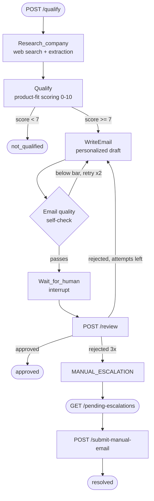

# AI Lead Intelligence Agent


An autonomous lead-qualification agent that researches a company, scores its fit against a given product/service, drafts a personalized outreach email, and routes the result through a human-in-the-loop review process with automatic self-correction and escalation — built on **LangGraph**, **FastAPI**, and **Supabase (Postgres)**, with evaluation and observability via **Braintrust**.

## What it does

Given a company and a product/service description, the agent:

1. **Researches** the target company via live web search
2. **Scores** how good a fit that company is for the specific product being offered (not a generic "is this a good company" score — it's product-aware)
3. **Drafts** a personalized outreach email
4. **Self-grades** the email's quality and automatically rewrites it if it falls below a quality bar — before a human ever sees it
5. **Pauses for human review** — a reviewer can approve, or reject with feedback, sending the agent back to rewrite
6. **Escalates to a human** automatically after repeated rejections, with a full context summary, instead of looping forever

## Architecture



The graph state is persisted with an **async Postgres checkpointer**, so a paused review survives a server restart — approving or rejecting a lead hours later works exactly the same as immediately after.

## Key engineering details

- **Fully async** end-to-end (FastAPI → LangGraph → Postgres) with a real async connection pool, verified under concurrent load
- **Persistent, restart-safe state** via `AsyncPostgresSaver`, not in-memory
- **Retry logic** around LLM calls, since small/fast models occasionally return malformed structured output
- **Output validation** on LLM-generated fields (e.g. clamping an out-of-range qualification score, correcting a mis-typed employee count) rather than trusting raw model output
- **Self-healing emails**: an independent AI "judge" scores each drafted email and triggers an automatic rewrite if it fails basic quality checks
- **Dynamic product-fit qualification**: the product/service being offered is a real input, not hardcoded — the same company can score completely differently against two different products
- **Human-in-the-loop with a bounded retry limit**: rejections trigger a rewrite with feedback, up to a fixed number of attempts, before escalating to a human — the agent never loops forever
- **API key authentication and per-IP rate limiting** on every endpoint, protecting both the data and the upstream LLM/search API usage from abuse

## Tech stack

`FastAPI` · `LangGraph` · `Groq (Llama)` · `Tavily Search` · `Supabase (Postgres)` · `psycopg` (async) · `Braintrust` · `pytest`

## Getting started

```bash
git clone <this-repo-url>
cd Lead-Intelligence-Agent
pip install -r requirements.txt
```

Create a `.env` file with:

```
GROQ_API_KEY=...
TAVILY_API_KEY=...
DATABASE_URL=...
BRAINTRUST_API_KEY=...
APP_API_KEY=...
```

Run the server:

```bash
uvicorn main:app
```

**Or run it containerized with Docker:**
```bash
docker build -t lead-intelligence-agent .
docker run -d -p 8000:8000 --env-file .env lead-intelligence-agent
```

**Or deploy it to Kubernetes** (manifests included — `deployment.yaml`, `service.yaml`):
```bash
kubectl create secret generic lead-agent-secrets --from-env-file=.env
kubectl apply -f deployment.yaml -f service.yaml
```
Config (API keys, DB URL) is injected via a Kubernetes Secret, not baked into the image. Rolling updates (`kubectl rollout restart deployment lead-agent-deployment`) replace pods with zero downtime.

## API reference

All endpoints require an `X-API-Key` header, and are rate-limited per IP.

**Qualify a lead**
```bash
curl -X POST http://localhost:8000/qualify \
  -H "Content-Type: application/json" \
  -H "X-API-Key: <your-app-api-key>" \
  -d '{"company_name": "HubSpot", "company_description": "a CRM and marketing automation platform", "product_description": "We build custom AI agents and automation systems for businesses that want to reduce manual work."}'
```

**Review a lead (approve or reject with feedback)**
```bash
curl -X POST http://localhost:8000/review \
  -H "Content-Type: application/json" \
  -H "X-API-Key: <your-app-api-key>" \
  -d '{"lead_id": "LEAD-XXXX", "company_name": "HubSpot", "is_approved": false, "human_feedback": "too generic, mention their actual product"}'
```

**View the human-escalation queue**
```bash
curl http://localhost:8000/pending-escalations -H "X-API-Key: <your-app-api-key>"
```

**Manually resolve an escalated lead**
```bash
curl -X POST http://localhost:8000/submit-manual-email \
  -H "Content-Type: application/json" \
  -H "X-API-Key: <your-app-api-key>" \
  -d '{"lead_id": "LEAD-XXXX", "email_subject": "A personal note", "email_body": "..."}'
```

## Testing & evaluation

- `pytest test_main.py -v` — automated integration tests against all 4 endpoints
- `python3 eval_research.py` — Braintrust evaluation: does the research step find the *correct* company (guards against the agent mixing up a target company with an unrelated one)
- `python3 eval_qualify.py` — Braintrust evaluation: does the scoring step produce sensible, product-aware judgments

## Observability

Every `/qualify` call is traced live to Braintrust, including an automatic email-quality score attached to each generated email — giving a real-time view into agent behavior beyond pass/fail testing.

## CI/CD

Every push to `main` automatically triggers a GitHub Actions pipeline: builds the Docker image, runs the container, waits for a healthy startup, then runs the full test suite against the live container — failing loudly if anything breaks. Workflow: [`.github/workflows/ci.yml`](.github/workflows/ci.yml).

## Infrastructure

This system is fully containerized and deployed, not just designed:

- **Docker** — packaged as a single image, verified with a full integration test run inside the container itself
- **Kubernetes** — running as a 3-replica Deployment behind a load-balancing Service, with self-healing (a killed pod is automatically replaced) and zero-downtime rolling updates
- **CI/CD** — every push to `main` triggers GitHub Actions: builds the image, runs it, waits for a healthy startup, and runs the full test suite against the live container
- **Next step:** cloud hosting (Azure) for public access

## License

MIT
