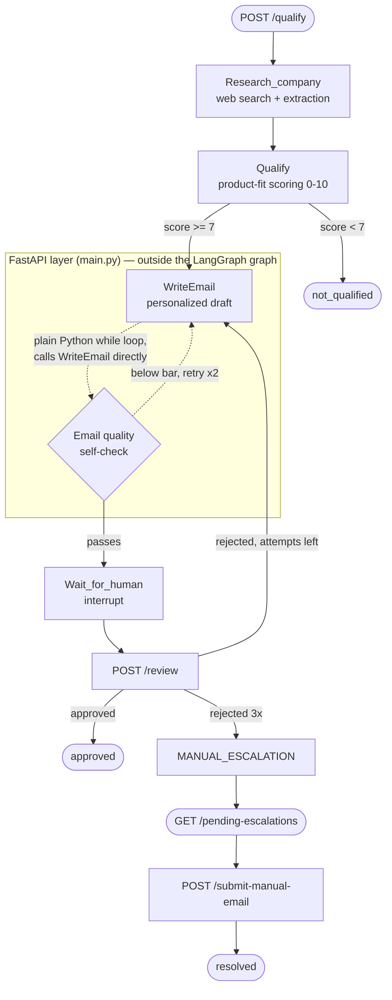
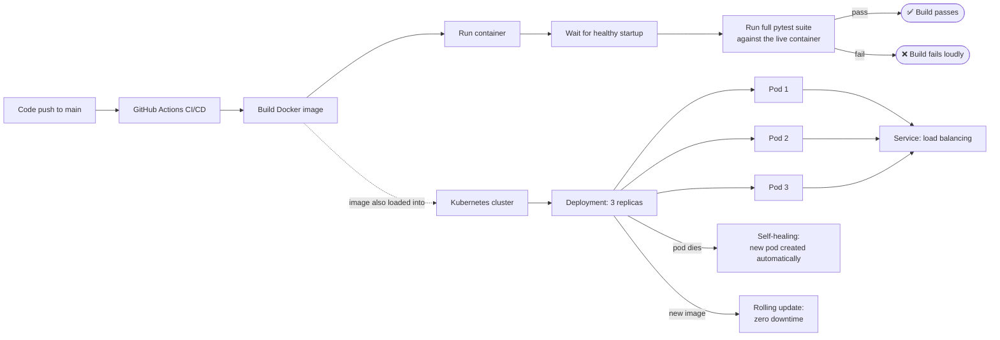

# AI Lead Intelligence Agent

[](https://github.com/MuhammadAbbas01/lead-intelligence-agent/actions/workflows/ci.yml)
[](https://www.python.org/)
[](https://fastapi.tiangolo.com/)
[](https://www.docker.com/)
[](https://kubernetes.io/)
[](LICENSE)

An autonomous lead-qualification agent that researches a company, scores its fit against a given product/service, drafts a personalized outreach email, and routes the result through a human-in-the-loop review process with automatic self-correction and escalation — built on **LangGraph**, **FastAPI**, and **Supabase (Postgres)**, with evaluation and observability via **Braintrust**.

## Contents

- [What it does](#what-it-does)
- [Architecture](#architecture)
- [Key engineering details](#key-engineering-details)
- [Tech stack](#tech-stack)
- [Getting started](#getting-started)
- [API reference](#api-reference)
- [Testing & evaluation](#testing--evaluation)
- [Database & persistence](#database--persistence)
- [Known limitations](#known-limitations)
- [Observability](#observability)
- [CI/CD](#cicd)
- [Infrastructure](#infrastructure)

## What it does

Given a company and a product/service description, the agent:

1. **Researches** the target company via live web search
2. **Scores** how good a fit that company is for the specific product being offered (not a generic "is this a good company" score — it's product-aware)
3. **Drafts** a personalized outreach email
4. **Self-grades** the email's quality and automatically rewrites it if it falls below a quality bar — before a human ever sees it
5. **Pauses for human review** — a reviewer can approve, or reject with feedback, sending the agent back to rewrite
6. **Escalates to a human** automatically after repeated rejections, with a full context summary, instead of looping forever

## Architecture



The graph state is persisted with an **async Postgres checkpointer**, so a paused review survives a server restart — approving or rejecting a lead hours later works exactly the same as immediately after. Note that the pre-review quality self-check (dashed box above) runs as a loop in the API layer, not as a node inside the graph itself — the rewritten draft is saved to the database but not written back into the graph's own checkpointed state, since no human has seen it yet at that point.

### How the routing and self-healing actually work

The agent is a state machine (LangGraph), not a single prompt — each box in the diagram above is a separate node, and the arrows between them are conditional routing decisions made in code, not by the model deciding what to do next:

- **Qualification gate**: after `Qualify`, a plain Python `if score >= 7` decides whether to proceed to `WriteEmail` or stop at `not_qualified`. The model scores; the routing is deterministic.
- **Email self-healing**: after a draft is written, a separate LLM call (`score_email_quality`) grades it against three fixed criteria. If it scores below 0.5, `main.py` calls `WriteEmail` again directly in a plain `while` loop — up to 2 extra attempts — before ever showing a human anything. This runs in the API layer, not as a node inside the graph, since no human has reviewed it yet at that point. This catches a generic or off-topic draft before it wastes a reviewer's time.
- **Bounded human-feedback loop**: a `human_feedback`/`is_approved` state is written by `POST /review`. If rejected and `attempt_count < max_attempts` (3), the graph routes back to `WriteEmail` with that feedback included in the next prompt. If the limit is reached, it routes to `MANUAL_ESCALATION` instead of retrying forever.
- **Escalation**: once escalated, the lead's `escalation_summary` is written to the database and the lead appears in `GET /pending-escalations` — a human then resolves it directly via `POST /submit-manual-email`, bypassing the LLM entirely for that lead.

None of this routing lives in a prompt — it's plain `if`/`while` logic reading fields off the graph state, with the LLM only ever responsible for scoring or generating content, never for deciding what happens next.

## Key engineering details

- **Fully async** end-to-end (FastAPI → LangGraph → Postgres), using connection pools rather than a single shared connection, so multiple requests can be handled concurrently without one request blocking another on database I/O
- **Persistent, restart-safe state** via `AsyncPostgresSaver`, not in-memory
- **Retry logic** around LLM calls, since small/fast models occasionally return malformed structured output
- **Output validation** on LLM-generated fields (e.g. clamping an out-of-range qualification score, correcting a mis-typed employee count) rather than trusting raw model output
- **Self-healing emails**: an independent AI "judge" scores each drafted email and triggers an automatic rewrite if it fails basic quality checks
- **Dynamic product-fit qualification**: the product/service being offered is a real input, not hardcoded — the same company can score completely differently against two different products
- **Human-in-the-loop with a bounded retry limit**: rejections trigger a rewrite with feedback, up to a fixed number of attempts, before escalating to a human — the agent never loops forever
- **API key authentication and per-IP rate limiting** on every endpoint (5/min on the two LLM-backed routes, 10–20/min on the lighter DB-only routes), protecting both the data and the upstream LLM/search API usage from abuse
- **Found and fixed a real production bug**: the LangGraph checkpointer originally held a single raw Postgres connection that Supabase silently closed after a period of idle time, causing every request to fail with no restart. Replaced it with a connection pool with automatic dead-connection detection, matching the pattern already used elsewhere in the codebase — confirmed fixed by running the full test suite again after a long idle period

## Tech stack

`FastAPI` · `LangGraph` · `Groq (Llama)` · `Tavily Search` · `Supabase (Postgres)` · `psycopg` (async) · `Braintrust` · `pytest`

## Getting started

```bash
git clone <this-repo-url>
cd Lead-Intelligence-Agent
pip install -r requirements.txt
```

Create a `.env` file with:

```
GROQ_API_KEY=...
TAVILY_API_KEY=...
DATABASE_URL=...
BRAINTRUST_API_KEY=...
APP_API_KEY=...
```

Run the server:

```bash
uvicorn main:app
```

**Or run it containerized with Docker:**
```bash
docker build -t lead-intelligence-agent .
docker run -d -p 8000:8000 --env-file .env lead-intelligence-agent
```

**Or deploy it to Kubernetes** (manifests included — `deployment.yaml`, `service.yaml`):
```bash
kubectl create secret generic lead-agent-secrets --from-env-file=.env
kubectl apply -f deployment.yaml -f service.yaml
```
Config (API keys, DB URL) is injected via a Kubernetes Secret, not baked into the image. Rolling updates (`kubectl rollout restart deployment lead-agent-deployment`) replace pods with zero downtime.

## API reference

All endpoints require an `X-API-Key` header, and are rate-limited per IP.

| Endpoint | Method | Purpose |
|---|---|---|
| `/qualify` | POST | Entry point. Takes a company + product description, runs the full research → score → draft pipeline, and returns either `not_qualified` or `pending_review` with a drafted email. |
| `/review` | POST | A human decision on a pending lead. Approve, or reject with feedback — feedback is fed back into the agent for a rewrite. |
| `/pending-escalations` | GET | Lists leads that hit the 3-rejection limit and need a human to write the email manually. |
| `/submit-manual-email` | POST | Resolves an escalated lead with a human-written email, bypassing the LLM for that lead. |

**Qualify a lead**
```bash
curl -X POST http://localhost:8000/qualify \
  -H "Content-Type: application/json" \
  -H "X-API-Key: <your-app-api-key>" \
  -d '{"company_name": "HubSpot", "company_description": "a CRM and marketing automation platform", "product_description": "We build custom AI agents and automation systems for businesses that want to reduce manual work."}'
```

**Review a lead (approve or reject with feedback)**
```bash
curl -X POST http://localhost:8000/review \
  -H "Content-Type: application/json" \
  -H "X-API-Key: <your-app-api-key>" \
  -d '{"lead_id": "LEAD-XXXX", "company_name": "HubSpot", "is_approved": false, "human_feedback": "too generic, mention their actual product"}'
```

**View the human-escalation queue**
```bash
curl http://localhost:8000/pending-escalations -H "X-API-Key: <your-app-api-key>"
```

**Manually resolve an escalated lead**
```bash
curl -X POST http://localhost:8000/submit-manual-email \
  -H "Content-Type: application/json" \
  -H "X-API-Key: <your-app-api-key>" \
  -d '{"lead_id": "LEAD-XXXX", "email_subject": "A personal note", "email_body": "..."}'
```

## Testing & evaluation

- `pytest test_main.py -v` — automated integration tests against all 4 endpoints
- `python3 eval_research.py` — Braintrust evaluation: does the research step find the *correct* company (guards against the agent mixing up a target company with an unrelated one)
- `python3 eval_qualify.py` — Braintrust evaluation: does the scoring step produce sensible, product-aware judgments

## Database & persistence

Supabase (hosted Postgres) is used in two distinct ways, through two different connection modes:

| Use case | Connection type | Why |
|---|---|---|
| LangGraph checkpointer (`agent.py`) | Session pooler, port `5432`, via an `AsyncConnectionPool` | Needs a long-lived connection to persist paused agent state, so a review can be approved hours later. Originally a single raw connection — see the bug fix below. |
| Application queries (`database.py`) | Transaction pooler, port `6543`, via `DatabaseManager` | Short-lived queries (create/update a lead, fetch escalations) — better suited to a transaction pooler, which recycles connections per query. |

Both use `check=AsyncConnectionPool.check_connection`, so a connection Supabase has silently closed is detected and replaced automatically instead of failing the next request.

### Data model

Two tables in Supabase Postgres:

**`leads`** — one row per lead, updated in place as it moves through the pipeline
| Column | Purpose |
|---|---|
| `lead_id` | Primary key, e.g. `LEAD-9615B60B` |
| `company_name`, `company_description` | The original input |
| `status` | `processing` → `not_qualified` / `pending_review` → `approved` / `escalated` / `resolved` |
| `qualify_score`, `qualify_reason` | The product-fit score and the model's reasoning for it |
| `company_info`, `company_website`, `company_problem`, `company_size` | Structured facts extracted by the research step |
| `email_subject`, `email_body` | The current draft |
| `human_feedback`, `escalation_summary` | Set when a reviewer rejects, or when escalated |
| `updated_at` | Set on every update, so it also doubles as an audit trail of the last change |

**`lead_drafts`** — one row per email draft attempt, so the full revision history is kept even after `leads` moves on
| Column | Purpose |
|---|---|
| `draft_id` | Primary key |
| `lead_id` | Which lead this draft belongs to |
| `attempt_number` | 1st draft, 1st rewrite, 2nd rewrite, etc. |
| `email_subject`, `email_body` | That attempt's content |
| `is_approved`, `human_feedback` | The outcome of that specific attempt |

## Known limitations

Being upfront about what this project has *not* yet done, rather than implying otherwise:

- No formal load testing or latency benchmarking has been run — the async/pooling design is intended to handle concurrent requests without blocking, but no specific throughput or response-time numbers have been measured
- Kubernetes is currently running locally via `kind`, not on a public cloud cluster — anyone outside the local machine can review the manifests and CI/CD, but can't hit a live public endpoint yet (Azure deployment is the planned next step)

## Observability

- Every `/qualify` call is wrapped in `@traced` and sent live to **Braintrust**, including the full input (company + product description) and the agent's output.
- An independent LLM "judge" (`score_email_quality`) grades each generated email on three criteria — mentions the actual product, professional tone, personalized (not generic) — and that score is logged to the same trace via `current_span().log(scores=...)`.
- Two standalone evaluation scripts run *outside* the live API, against fixed test cases, to catch regressions before they reach production traffic:
  - `eval_research.py` — does the research step correctly identify the target company, rather than confusing it with an unrelated one with a similar name
  - `eval_qualify.py` — does the scoring step produce sensible, product-aware judgments rather than a generic company rating
- This gives three layers of quality signal: automated tests (does it work), live tracing (what did it actually do for a real request), and evaluation scripts (is output quality holding up over time)

## CI/CD

Every push to `main` automatically triggers a GitHub Actions pipeline: builds the Docker image, runs the container, waits for a healthy startup, then runs the full test suite against the live container — failing loudly if anything breaks. Workflow: [`.github/workflows/ci.yml`](.github/workflows/ci.yml).

## Infrastructure

This system is fully containerized and deployed, not just designed:



**How this actually works, step by step:**

1. A code push to `main` triggers GitHub Actions automatically — no manual deploy step.
2. The pipeline builds a fresh Docker image from the `Dockerfile`, exactly the same image whether it runs locally or in the cluster.
3. It starts a real container from that image and polls `/docs` until the app reports healthy, rather than assuming it started correctly.
4. The full `pytest` suite runs against that *live* container over HTTP — the same way a real client would call it — not against mocked internals.
5. A single failed assertion fails the whole pipeline loudly; nothing broken can silently merge.
6. Separately, the same built image is loaded into a Kubernetes cluster (`kind` for local development) and run as a **Deployment** of 3 replica pods.
7. A **Service** in front of the pods gives one stable address and spreads incoming traffic across whichever pods are currently healthy.
8. If a pod is killed or crashes, the Deployment controller detects the mismatch between desired and actual replica count and creates a replacement automatically — verified by manually deleting a running pod and watching a new one appear within seconds.
9. Pushing a new image and running `kubectl rollout restart` replaces all 3 pods one at a time, so the Service always has at least one healthy pod to route to — no downtime window.

**Next step:** cloud hosting (Azure) so the system is reachable outside the local machine.

## License

MIT
